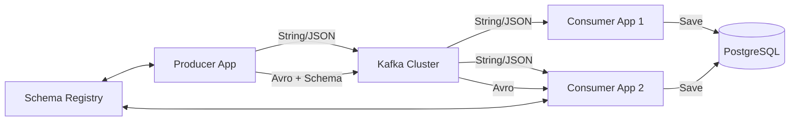

# Kafka Spring Boot Research POC

Research and practical implementation of Event-Driven Architecture using Spring Boot and Apache Kafka.

## 🏗️ Current Architecture

The system consists of microservices communicating via Kafka and persisting data to PostgreSQL.



### Modules

1.  **modules/producer-app**:
    *   Sends String/JSON messages.
    *   Sends **Avro** messages integrated with **Schema Registry**.
    *   REST API to trigger events.

2.  **modules/consumer-app** (Consumer 1):
    *   Basic consumer handling String/JSON.
    *   Error handling with **Dead Letter Queue (DLQ)**.
    *   Persists message history to DB (`MessageReceived`, `MessageError`).

3.  **modules/Consumer-app2** (Consumer 2):
    *   Advanced consumer supporting multiple formats.
    *   **Avro Consumer**: Automatically deserializes objects from Schema Registry.
    *   Custom `KafkaConsumerConfig` for multiple factories (String & Avro).

4.  **modules/common-***:
    *   `common-models`: Shared DTOs and Avro Schemas.
    *   `common-persistence`: JPA Entities and Repositories.

---

## 🚀 Implemented Features

### 1. Producer
*   [x] **REST API**: Endpoints to publish messages (`/publish`, `/schema-registry/publish`).
*   [x] **Avro Serialization**: Automatically generate classes from `.avsc` files and send with Schema ID.
*   [x] **Schema Registry**: Integrated Confluent Schema Registry for schema version management.

### 2. Consumer
*   [x] **String/JSON Consumption**: Consume standard text messages.
*   [x] **Avro Consumption**: Consume Avro messages, automatically mapping to Java Objects (`Employee`).
*   [x] **Persistence**: Save all received messages to PostgreSQL for auditing.
*   [x] **Error Handling**: Retry mechanism and push failed messages to DLQ (Dead Letter Topic).
*   [x] **Multi-Factory Config**: Separate configurations for String Consumer and Avro Consumer within the same application.

### 3. Infrastructure
*   [x] **Docker Compose**: Full stack setup (Kafka, Zookeeper, Schema Registry, Postgres, Kafka UI, Prometheus, Grafana).
*   [x] **Gradle Build**: Multi-module build configuration, Avro source generation plugin.
*   [x] **Monitoring**: Prometheus & Grafana stack for observing metrics.

---

## 🛠️ How to Run

### 1. Initialize Infrastructure
```bash
cd docker
docker-compose up -d
```
*   Kafka UI: http://localhost:8080
*   Schema Registry: http://localhost:8081
*   Prometheus: http://localhost:9096 (External port)
*   Grafana: http://localhost:3000

### 2. Run Applications
**Producer:**
```bash
./gradlew :modules:producer-app:bootRun
```

**Consumer 1 (Basic):**
```bash
./gradlew :modules:consumer-app:bootRun
```

**Consumer 2 (Avro Support):**
```bash
./gradlew :modules:Consumer-app2:bootRun
```

### 3. Test Message Sending
**Send Avro Message (Employee):**
```bash
curl -X POST http://localhost:5000/schema-registry/publish
```
*   Producer will generate fake data, validate schema with Registry, and send to `consume-employee` topic.
*   Consumer 2 will receive, deserialize into `Employee` object, and log to console.

---

## 📝 Roadmap (To Do)

To complete this research POC, the next objectives include:

### Kafka Streams (Stream Processing)
- [ ] Implement `streams-app` for real-time data processing.
- [ ] Example: Count Employees by Department (Aggregation).
- [ ] Example: Join Employee stream with Department stream.

### Security & Production Ready
- [ ] Configure SASL/SSL Authentication for Kafka.
- [ ] Optimize Producer (Batch size, Linger ms).
- [ ] Configure Graceful Shutdown for Consumer.

### Advanced Patterns
- [ ] **Transactional Messaging**: Ensure "Exactly-once" semantics.
- [ ] **Schema Evolution**: Test modifying `.avsc` files (adding fields) and check compatibility (Backward/Forward).

---
*Last Updated: November 29, 2025*