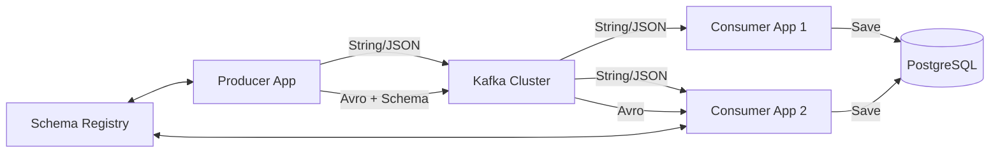

# Kafka Spring Boot Research POC

Dự án nghiên cứu và triển khai thực tế kiến trúc Event-Driven với Spring Boot và Apache Kafka.

## 🏗️ Kiến trúc hiện tại

Hệ thống bao gồm các thành phần microservices giao tiếp qua Kafka và lưu trữ dữ liệu xuống PostgreSQL.



### Các Module

1.  **modules/producer-app**:
    *   Gửi message dạng String/JSON.
    *   Gửi message dạng **Avro** tích hợp **Schema Registry**.
    *   REST API để trigger events.

2.  **modules/consumer-app** (Consumer 1):
    *   Consumer cơ bản xử lý String/JSON.
    *   Xử lý lỗi với **Dead Letter Queue (DLQ)**.
    *   Lưu lịch sử message vào DB (`MessageReceived`, `MessageError`).

3.  **modules/Consumer-app2** (Consumer 2):
    *   Consumer nâng cao hỗ trợ đa định dạng.
    *   **Avro Consumer**: Tự động deserialize object từ Schema Registry.
    *   Cấu hình `KafkaConsumerConfig` tùy chỉnh cho nhiều loại factory (String & Avro).

4.  **modules/common-***:
    *   `common-models`: Các DTO và Avro Schemas chia sẻ.
    *   `common-persistence`: Entity và Repository JPA.

---

## 🚀 Tính năng đã hoàn thành (Implemented)

### 1. Producer
*   [x] **REST API**: Endpoint gửi message (`/publish`, `/schema-registry/publish`).
*   [x] **Avro Serialization**: Tự động generate class từ file `.avsc` và gửi kèm Schema ID.
*   [x] **Schema Registry**: Tích hợp Confluent Schema Registry để quản lý version schema.

### 2. Consumer
*   [x] **String/JSON Consumption**: Đọc message text thông thường.
*   [x] **Avro Consumption**: Đọc message Avro, tự động map sang Java Object (`Employee`).
*   [x] **Persistence**: Lưu trữ mọi message nhận được vào PostgreSQL để audit.
*   [x] **Error Handling**: Cơ chế Retry và đẩy message lỗi vào DLQ (Dead Letter Topic).
*   [x] **Multi-Factory Config**: Tách biệt cấu hình cho String Consumer và Avro Consumer trong cùng 1 application.

### 3. Infrastructure
*   [x] **Docker Compose**: Setup full stack (Kafka, Zookeeper, Schema Registry, Postgres, Kafka UI).
*   [x] **Gradle Build**: Cấu hình build đa module, plugin generate Avro source.

---

## 🛠️ Hướng dẫn chạy (How to Run)

### 1. Khởi tạo hạ tầng
```bash
cd docker
docker-compose up -d
```
*   Kafka UI: http://localhost:8080
*   Schema Registry: http://localhost:8081

### 2. Chạy ứng dụng
**Producer:**
```bash
./gradlew :modules:producer-app:bootRun
```

**Consumer 1 (Basic):**
```bash
./gradlew :modules:consumer-app:bootRun
```

**Consumer 2 (Avro Support):**
```bash
./gradlew :modules:Consumer-app2:bootRun
```

### 3. Test gửi message
**Gửi Avro Message (Employee):**
```bash
curl -X POST http://localhost:5000/schema-registry/publish
```
*   Producer sẽ tạo data giả, validate schema với Registry, và gửi vào topic `consume-employee`.
*   Consumer 2 sẽ nhận, deserialize thành `Employee` object và log ra console.

---

## 📝 Roadmap (Cần làm thêm)

Để hoàn thiện bài nghiên cứu này, các mục tiêu tiếp theo bao gồm:

### Kafka Streams (Stream Processing)
- [ ] Implement `streams-app` để xử lý dữ liệu realtime.
- [ ] Ví dụ: Đếm số lượng Employee theo phòng ban (Aggregation).
- [ ] Ví dụ: Join stream Employee với stream Department.

### Security & Production Ready
- [ ] Cấu hình SASL/SSL Authentication cho Kafka.
- [ ] Tối ưu hóa Producer (Batch size, Linger ms).
- [ ] Cấu hình Graceful Shutdown cho Consumer.

### Advanced Patterns
- [ ] **Transactional Messaging**: Đảm bảo "Exactly-once" semantics.
- [ ] **Schema Evolution**: Test thử nghiệm thay đổi file `.avsc` (thêm field) và kiểm tra tính tương thích (Backward/Forward).
- [ ] **Monitoring**: Setup Prometheus + Grafana để theo dõi lag của Consumer.

---
*Last Updated: November 29, 2025*